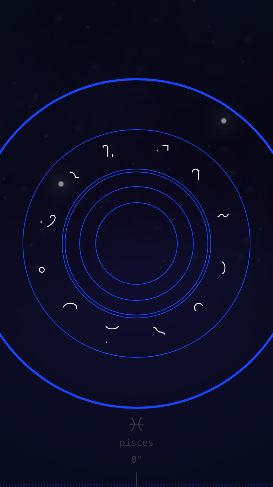
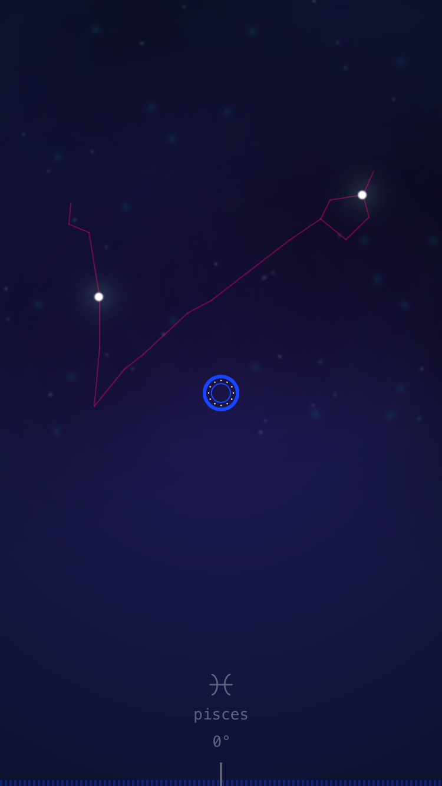
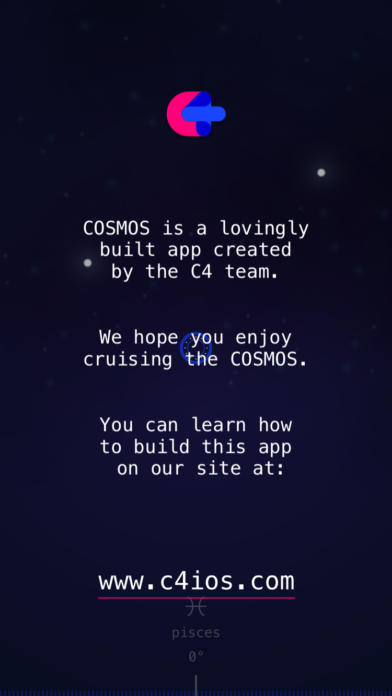

### Cosmos

**个人学习swift的练手项目**

#### 相关链接
[中文翻译](http://c4ios.swift.gg/)

[Core源代码地址以及介绍](https://github.com/C4Labs/C4iOS)

[GitHub项目地址](https://github.com/C4Labs/Cosmos)

#### 相关截图

**更多等待请你去发现**

#### 几点说明
- 仓库已将项目代码（core以及项目）升级至swift5.0版本。
- 适配iPhone X以及更新型号
- 仅在iOS11，12版本测试
- iOS13测试通过

